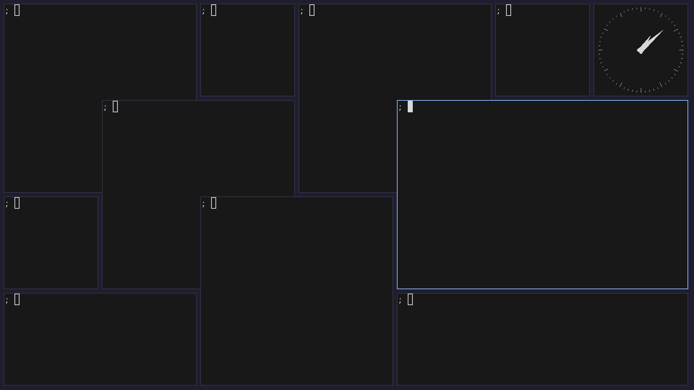

`┏━┛┏━ ┃┃┃┏┏ `  
`┃ ┃┏━┃┃┃┃┃┃┃`  
`━━┛━━ ━━┛┛┛┛`
============

Semi-stack and semi-tile window manager: Grid-Based window manager



Keybinds
-------

|      Keybind      | Action |
|-------------------|--------|
| Mod + Tab         | cycle window focus |
| Mod + f           | fullscreen |
| Mod + q           | kill window |
| Mod + Shift + Backspace   | quit |
| Mod + Space       | tile window |
| Mod + Return      | spawn termcmd |
| Mod + p           | spawn menucmd |
| Mouse hover       | focus |

see more in the [config file](def.config.h)


Layout
------

```
 ____ ____ ____ ____ 
| q  | w  | e  | r  |
|____|____|____|____|
| a  | s  | d  | f  |
|____|____|____|____|
| z  | x  | c  | v  |
|____|____|____|____|
```

Press Mod+Space to tile window from [cell] to [cell]

Why?!
-----

fredom


Thanks to
=========

 * catwm
 * tinywm
 * dwm
 * sxwm
